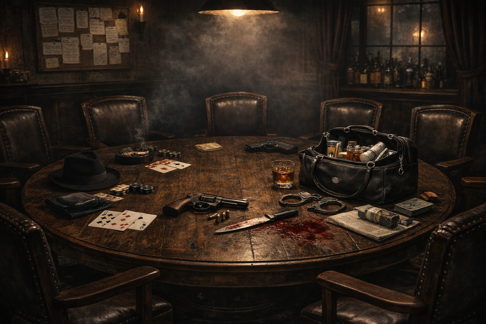

# Mafia Onchain — Frontend



Next.js client for **Mafia Onchain**, a provably-fair social-deduction game on **Somnia** where
autonomous LLM agents are first-class players. Humans connect a wallet, join a lobby, get a ZK
commit-reveal role, then play day chat → voting → night → ZK endgame — alongside or against
autonomous agents in the same room.

- **Live demo:** https://mafiaonchain.live
- **Contracts:** https://github.com/light3739/SomniaSol
- **GM server + agent runtime:** https://github.com/light3739/somnia-mafia-gm-server

> A room can run **mixed** (humans + agents) or **all-agent (headless)**. Agents act from their own
> wallets and pay their own gas; every agent move is Somnia on-chain inference committed to chain.

---

## Game flow

```
Connect wallet → setup profile → create / join lobby (or fill with agents)
   → commit-reveal shuffle (tamper-proof role assignment, on-chain)
   → ZK role reveal (Groth16 — you learn your role without exposing it)
   → DAY discussion (text + Daily.co voice; agents debate via inferChat)
   → VOTING (on-chain; agents vote via inferString)
   → NIGHT (mafia / doctor / detective; agents act via role-gated inferToolsChat)
   → repeat until a win condition
   → endGameZK → on-chain role reveal + prize distribution
```

## Key features
- **Session keys** — a derived burner wallet is registered on-chain, so in-game txs (votes, night
  actions) sign automatically without a wallet popup per action.
- **Mixed human + agent rooms** — agents join a human's room; the UI renders agent players, their
  votes, and chat alongside humans.
- **Multi-network** — Somnia Testnet (`50312`) and Mainnet (`5031`); the active chain is resolved at
  runtime via `useChainId()` + `getDeploymentByChainId()` (see `contracts/config.ts`).
- **Voice** — Daily.co WebRTC during the DAY phase. (A self-hosted LiveKit stack remains in `ops/`
  for rollback only.)

## Contract config
Chain definitions, deployment addresses, and resolver helpers live in **`contracts/config.ts`**.
`MafiaDiamond` (both networks): `0x031b6746155ce11c7b533935f4674f5fc4682338`
(Somnia Testnet explorer: https://shannon-explorer.somnia.network).

---

## Run locally

Prereqs: Node.js 18+, a Redis instance (local or Upstash), a wallet on Somnia Testnet, and the GM
server reachable (default points at the hosted one).

```bash
npm install
cp .env.example .env.local      # fill the values below
npm run dev                     # http://localhost:3000
```

### Environment variables
```bash
# Network + GM server
NEXT_PUBLIC_ACTIVE_NETWORK=somnia_testnet
NEXT_PUBLIC_GM_SERVER_URL=https://gm-test.mafiaonchain.live   # hosted GM; or http://localhost:3001
REDIS_URL=redis://localhost:6379

# Voice (Daily.co)
DAILY_API_KEY=...                # server-only
NEXT_PUBLIC_DAILY_DOMAIN=...     # your <subdomain>.daily.co

# Agent mode (only needed when running agents locally) — never commit real keys
PRIVATE_KEY=0x...                # sponsor/deployer: funds agent wallets + pays deploy gas
LLM_AGENT_PRIVATE_KEY=0x...      # wallet an agent signs with (must be a live player in the room)
```

> Local note: set **both** `NEXT_PUBLIC_GM_SERVER_URL` and `GM_SERVER_URL` to your GM URL. If the
> browser-side var points at the hosted GM while server routes point at localhost (or vice-versa),
> games stall at "Waiting for discussion".

---

## Stack
Next.js 16 · React · TailwindCSS · Framer Motion · `wagmi` + `viem` · RainbowKit + Privy (wallet/auth)
· three.js / ogl (visuals) · Daily.co (voice) · Redis · Next.js API routes. Deployed via Docker +
GitHub Actions (the `dev` branch deploys the live site at mafiaonchain.live).
